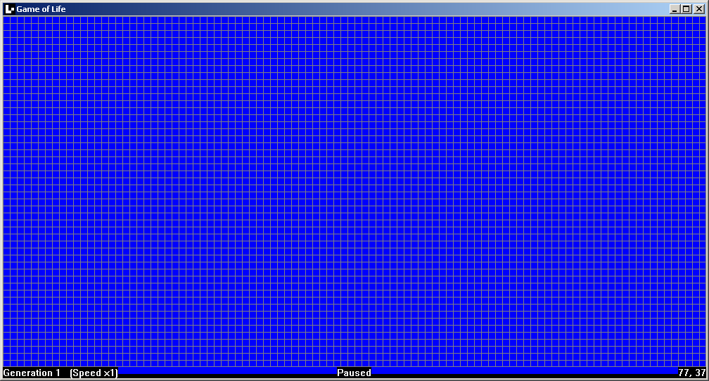

# Game Of Life Win32

`gol_win32.exe` is a Win32 implementation of [Conway's game of life](https://en.wikipedia.org/wiki/Conway%27s_Game_of_Life) in C++.  
It runs on Windows 2000+. A classic historical game that can run on any Windows from the last 26 years, what can beat that?

Originally written in C by [ReimarPB](https://github.com/ReimarPB) in 2022.

## Controls
- **Left Click:** Create cell
- **Space:** Pause
- **Right Arrow:** Next generation
- **Up/Down Arrow:** Increase/Decrease speed
- **R:** Reset game
- **G:** Toggle cell grid

## Building

### MSVC (Won't support Windows older than 7)
Open the folder in [Visual Studio Developer Command Prompt](https://docs.microsoft.com/en-us/visualstudio/ide/reference/command-prompt-powershell) and run `nmake`

### MinGW (Easiest, supports Windows XP+)
Run `make`

### GN (How I build it and make executables that still run on 2000+)
You can use the provided __BUILD.gn__ with [gn-legacy](https://github.com/Alex313031/gn-legacy) to target Windows 2000.
